---
hide:
  - toc
---

# About

A source of insight, practical pointers,and reflections on application security and clean-code practices.

In this site, I share my findings as I explore security exploits, vulnerabilities, and software in general. My goal is to grow as a hacker, developer, and bug bounty hunter, while keeping security, clarity, and maintainability at the core of everything I do.

I also use these entries as a personal knowledge base: a place to document/jot down what I’ve learned, organize useful concepts, keep track of things I want to revisit and archive information I want to keep coming back to as I continue growing my skills.

> For anyone who values **Clean Code**, **Good Development Practices**, **Application Security**, and is on their own journey of improvement.

###### The use of AI on this site is kept to a minimum and limited solely to grammar checking.

---

## Simple is Always __"Bueno"__!

```mermaid
graph TD
    %% Root
    Root[📦 Project Root]

    %% Main folders
    Root --> Docs[📚 docs/]
    Root --> Config[⚙️ Configuration]

    %% Docs structure
    Docs --> Archive[🗂️ archive/]
    Docs --> SharedDocs[📄 shared/]

    %% Archive contents
    Archive --> ArchAuthor[✍️ author/]
    Archive --> ArchImages[🖼️ images/]
    Archive --> ArchPosts[📝 posts/]

    %% Shared docs
    SharedDocs --> Stylesheets[🎨 stylesheets/]
    SharedDocs --> About[ℹ️ about.md]

    %% Configuration files
    Config --> Docker[🐳 docker-compose.yml]
    Config --> Dockerfile[🐳 Dockerfile]
    Config --> MainConfig[📘 mkdocs.yml]

    %% Styling
    style Root fill:#263238,stroke:#000,color:#ffffff,stroke-width:2px

    style Docs fill:#e3f2fd,stroke:#1e88e5,stroke-width:2px
    style Archive fill:#bbdefb,stroke:#1565c0,stroke-width:2px
    style SharedDocs fill:#e1f5fe,stroke:#0288d1,stroke-width:2px

    style Config fill:#f3e5f5,stroke:#7b1fa2,stroke-width:2px

    %% File-level styling
    classDef file fill:#ffffff,stroke:#90a4ae,stroke-width:1px
    class ArchConfig,About,CommonIndex,Docker,Dockerfile,MainConfig file

```

Beyond the initial template, this site has been extended with additional libraries and tools that I selectively integrate as needed. Each addition is chosen to improve structure, organization, and functionality, while staying aligned with long-term maintainability. I avoid unnecessary dependencies and prefer fully understanding what I use, so every library and organizational decision serves a clear purpose rather than convenience alone.

## Deployment with GitHub Actions

This site is automatically deployed using GitHub Actions. Every time changes are pushed to the main branch, a workflow is triggered to build the MkDocs site and publish the generated static files.
I try to keep it always up to date, removes the need for manual deployment, and keeps the publishing process consistent, repeatable and easy for me.

```mermaid
graph LR
    Dev[👨‍💻 Local Changes] --> GitHub[📦 GitHub Repository]
    GitHub --> Action[⚙️ GitHub Actions Workflow]
    Action --> Build[🏗️ Build MkDocs Site]
    Build --> Deploy[🚀 Deploy Static Site]
    Deploy --> Live[🌐 Live Documentation]

    %% Styling
    style Dev fill:#e3f2fd,stroke:#1e88e5
    style GitHub fill:#e8f5e9,stroke:#2e7d32
    style Action fill:#fff3e0,stroke:#ef6c00
    style Build fill:#ede7f6,stroke:#5e35b1
    style Deploy fill:#fce4ec,stroke:#ad1457
    style Live fill:#263238,stroke:#000,color:#ffffff
```

#