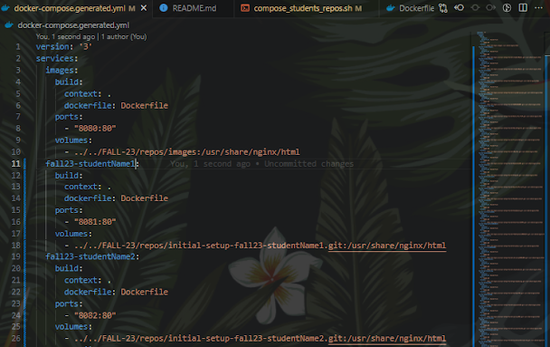

---
date:
  created: 2023-10-01
  updated: 2024-12-12
readtime: 8
pin: true
links:
  - Vault Index: archive/index.md
categories:
  - Vault
tags:
  - Automation
  - Bash Scripting
  - Docker
  - Git
authors:
  - robertovallado
slug: docker-in-the-classroom
---

# Automation in the classroom! PART II - Marking assignments with the help of Docker containers

 In part one, we explained the basic concepts and technologies used for the initial setup. This part of the article will take on the second half missing: Docker containers! Specifically, Nginx image for hosting single repos within a "Docker service." I think it is super cool, and I wonder if there is a better way. If you stumble upon this article and want to fork my repo, please do so.

<!-- more -->

I would love to see suggestions and Pull Requests for improvements. Ultimately, we would want this to ease other people's lives.

<h2 style="text-align:center;">Enter containers</h2>

Docker containers are a lightweight and portable way to package and run applications, along with all their dependencies, in isolated environments. 

**Isolation:** Containers provide process and file system isolation. Each container runs as an isolated process on the host operating system, with its own file system, network stack, and resources. This isolation ensures that applications in one container don't interfere with those in other containers or the host system.

**Portability:** Docker containers encapsulate an application and its dependencies into a single package. This package includes the application code, runtime, libraries, and configuration. This portability means you can create a container on one system and run it on another without worrying about compatibility issues, making it easier to move applications between different environments, such as development, testing, and production.

**Efficiency:** Containers share the host operating system's kernel, which makes them extremely lightweight and efficient. They start quickly and consume fewer resources than traditional virtual machines, as running a separate operating system for each container is unnecessary.

**Version Control:** Docker containers are typically defined using a Dockerfile, which specifies how to build the container image. These Dockerfiles can be version-controlled, allowing you to track changes to your application's environment over time.

**Orchestration:** Docker provides tools like Docker Compose and Kubernetes to help you manage and orchestrate containers at scale. This makes deploying, scaling, and managing applications composed of multiple containers easier.

**Community and Ecosystem:** Docker has a large and active community, which has led to a vast ecosystem of pre-built container images available on Docker Hub. This makes finding and using containers for various software and services accessible.

Overall, Docker containers have revolutionized how applications are developed, deployed, and managed by offering a consistent and efficient way to package and run software across different environments. They have become a fundamental technology in modern software development and deployment workflows.

## Back to our project
So, We start with the selection of our image and selecting it on the Dockerfile. Notice the comments on the snippet that helps explain some of the nuanced details of the syntax of a Dockerfile.

In the following snippet of code that does the concatenation and the formatting of the docker-compose.generated.yml we will see how this "Dockerfile" is called and set to each of the instances of the separated images.

I commented on each of the steps the script takes, but it will make more sense once you see the output result.

Ok, Roberto, cool. But now what? Well, now you have a .yml file that can compose to host all and each one of the repos. Simply run the command:

Voilà! Dynamic containers based on repos!

We, as programmers, are to solve problems or boring tasks by using all technologies at our disposal. We are shaping the current new connected world, and it is up to us to build on other people's code, always keeping security and optimal design in mind. 

>Don't forget to have fun while doing it and share it so others may build upon your code!

#