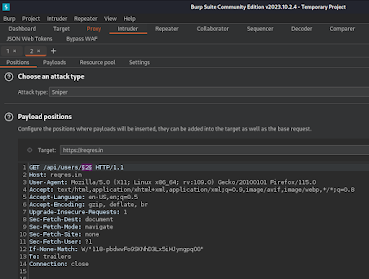
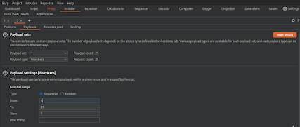

---
date:
  created: 2023-12-04
  updated: 2024-12-12
readtime: 8
pin: true
links:
  - Vault Index: archive/index.md
categories:
  - Vault
tags:
  - Online Security
  - Vulnerabilities
authors:
  - robertovallado
slug: api-security-and-predictable-ids
---

# Securing API Endpoints: The Importance of Unpredictable IDs on Development

 Over the weekend, I dedicated time to revisiting and consolidating my findings in the ongoing reconnaissance phase for an app's platform. As I dig deeper into the system, I realized the need for a precise and robust testing tool. BurpSuite Intruder came out as the perfect instrument for the impending test on our target. 
 
 <!-- more -->
 
BurpSuite Intruder capabilities, known for its adeptness in performing exhaustive tests and uncovering potential vulnerabilities, align seamlessly with the demands of our recon efforts. This realization sets the stage for a comprehensive and systematic examination of the application platform, ensuring a meticulous assessment that goes beyond the surface-level insights.

## The Context 

In my current engagement with a REST API target, a critical aspect of data retrieval revolves around using unique identifiers assigned to various objects within the system. These identifiers, called IDs, are the key mechanism for fetching specific objects from the database. I noticed that these IDs are of the integer type, or at least that's the inference drawn from the patterns observed in API responses. This revelation prompts a deeper exploration into the implications of using integer-based IDs and the considerations that come into play when dealing with the predictability of identifiers in a RESTful context.

## Introducing BurpSuite Intruder

I could select the endpoint I wanted to test, send it to Intruder, select the Position parameter that I wanted to update on my payload, and (here comes the fun part) set it to a range of numbers. Simple as a hacker, dangerous as a developer.

>(Sample API for demonstration purposes)

Intruder can span the requests with a time delimiter; leverage that with IP Rotate BurpSuite extension and you are set! As a Hacker, I was excited; as a Developer, uhm, not so much; I kept thinking about the people who made the API; their only mistake was making this application very simple and easy to understand.

### As developers, how can we anticipate and prevent hacking attempts?

I will simplify the why and how not to for this use case and share my knowledge with my team for input.

---

When it comes to web development and API design, even the most minor details can significantly impact the security and privacy of our systems. One such detail that requires careful consideration is the predictability of IDs associated with data transfer objects (DTOs) that interact with APIs. The choice between predictable and unpredictable IDs can significantly affect the overall strength of our applications. In this discussion, we will explore why unpredictable IDs are a fundamental necessity not just a best practice. We will address security risks, privacy concerns, and potential vulnerabilities that may arise when IDs follow a predictable pattern. Let's take a closer look at why developers and architects should prioritize the unpredictability of IDs in their APIs.

## Security Risk
Predictable IDs can expose your system to security risks, mainly if used in authentication, authorization, or other security-critical operations. An attacker may attempt to guess or enumerate IDs to gain unauthorized access to resources.

### Data Enumeration Attacks
If IDs follow a predictable pattern, attackers can use data enumeration attacks to retrieve sensitive information about your system's scale and structure by sequentially guessing or iterating through IDs.

### Brute Force Attacks
Predictable IDs make it easier for attackers to conduct brute-force attacks. For example, they may try brute-force access tokens or other sensitive information associated with predictable IDs.

### User Privacy
If user-related IDs are predictable and exposed publicly, it can lead to privacy concerns. For instance, if user accounts are sequentially numbered, it might be possible to deduce information about the number of users or the order in which accounts were created.

### Ease of Exploitation
Predictable IDs simplify the task for attackers. If they can easily guess or infer the structure of your IDs, it lowers the bar for exploiting vulnerabilities.

### Unintentional Data Exposure
In situations where IDs are utilized in public-facing contexts such as URLs, predictable IDs may inadvertently expose sensitive information to external parties or malicious actors.

### Mitigating Risk
Using less predictable IDs, such as GUIDs or UUIDs, makes it harder for attackers to exploit ID predictability. These identifiers are unique, reducing the likelihood of collisions and guessing.

Unpredictable identifier is crucial for enhancing the security and privacy of a system. While it may seem convenient to use sequentially numbered IDs due to their simplicity, the potential consequences of predictability must be carefully considered, especially in the dynamic domains of APIs and web applications where security is of importance.
Unpredictable IDs are an effective way to deter potential threats. Their randomness and lack of patterns make it much harder for malicious actors to exploit vulnerabilities associated with predictable IDs. On the other hand, sequentially numbered IDs create a vulnerability surface that could be exploited through data enumeration attacks, brute force attempts, amongst other methods.

In the world of APIs and web applications, where maintaining data integrity, user privacy, and system security is of utmost importance, unpredictable IDs are not just a best practice but a fundamental necessity. By using identifiers like GUIDs or UUIDs that offer a high degree of randomness and uniqueness, developers can strengthen their systems against unauthorized access, data breaches, and privacy violations. 
Its crucial to prioritize security considerations and recognize the pivotal role that unpredictable IDs.

#